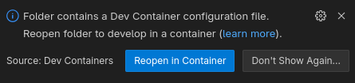

# Part 1: Docker and ROS (without devcontainer)
## No DevContainer (yet)
When you open this repositories folder in VS Code you'll get asked if you want to open in a container:

Just ignore it or press the small X in the top-right corner to close it.

If you already opened from inside the dev container or accidentially clicked on "Reopen in Container" click on "File" > "Open Recent" > and click on the folder without "[Dev Container]" in the name (it should be the top entry in the list).

## Introduction
Even if you want to use devContainer it is best practice to have a setup that also runs without it so people can run your container even if something does not work with their setup or if they want to use another IDE/Editor and not VS Code. It also makes it easier to deploy your docker container to the robot later on. I prefere `docker compose` to configure my docker container so I don't have to run long `docker`-commands.

## Installation
You need to install at least [VS Code](https://code.visualstudio.com/download) and [Docker-CE](https://docs.docker.com/engine/install/), see the [Installation section in the Readme](README.md#installation).

## First steps with `docker compose`
First lets take a look at a simple ROS 2 setup with two custom ros packages in the `ros`-folder, it contains one package that publishes and a second package that has a subscriber to these messages. Its taken from the [tutorial for writing a basic publisher and subscriber in python.](https://docs.ros.org/en/jazzy/Tutorials/Beginner-Client-Libraries/Writing-A-Simple-Py-Publisher-And-Subscriber.html) So it should be easy to understand however both single subscriber and publisher scripts are accompanied by a some files to create individual packages and launch files for both as you might find in a more complex ROS 2 setup.

The application for this could be one ROS-package that you install on your PC while the other is running on your robot (often times accompanied by a third package that contains shared ROS-messages on both but as we are only sending basic strings we use the `std_msgs`-package that comes with our ROS 2 installation).
We will look at more realistic use cases in the later parts.

Because they are separated services they both can be seen as individual machines separated from your computer (your host machine) with their own file systems and networking. Docker compose automatically connects both to the same virtual network so we don't need to configure that.

Open a terminal, cd into the `part1`-folder of this repository and type `docker compose up publishing subscribing`. It will build and run the 2 docker images and start 2 docker container, one for publishing and one for subscribing, one outputs to the local docker network and the other is receiving these messages.
The source for both packages can be found in the `ros/`-folder

When you press <kbd>Ctrl</kbd>+<kbd>c</kbd> both container should exit, if you can't wait for them to stop, press <kbd>Ctrl</kbd>+<kbd>c</kbd> again or close the terminal window.

Afterwards you need to run `docker compose down` in the `part1`-folder to make sure both docker container and the network are removed.

This is nice as you now have a ROS 2 setup system-independent 
All files are build in your container, however you need to rebuild the docker container with `docker compose build` every time you change any file in your ros-packages and the files from the docker image differ from your local files. 

**Try for yourself**: 
1. Check out this repository and open it in VS Code, ignore/close the popup in the bottom right asking you to reopen in Dev Container
1. Build the container using `docker compose build` in the `part1`-folder
1. Change code in the `ros`-folder, for example change line 18 in the file `ros/publishing/publishing/main.py` from `msg.data = 'Hello World: %d' % self.i` to `msg.data = 'Sending: %d' % self.i`
1. restart the docker container without building by just running `docker compose up` in the `part1`-folder. You will still see the `Hello World`-messages.
1. re-run the `docker compose build`-command and then restart with `docker compose up`, now you should see the updated data getting published.
1. Run `docker compose down` inside the `part1`-folder for cleanup.

Also take a look at the [ROS 2 docker page on DockerHub](https://hub.docker.com/_/ros/) as it has some more informations and examples.

After you done the basic tutorials and are a bit advanced in ROS 2 I recommend you take a look at the articles at https://design.ros2.org/ as they explain the core functionality of ROS. At least keep in mind that this side exists in case you need a reference if you encounter some behavior of ROS that might seem strange or if you want to extend your system with security.
