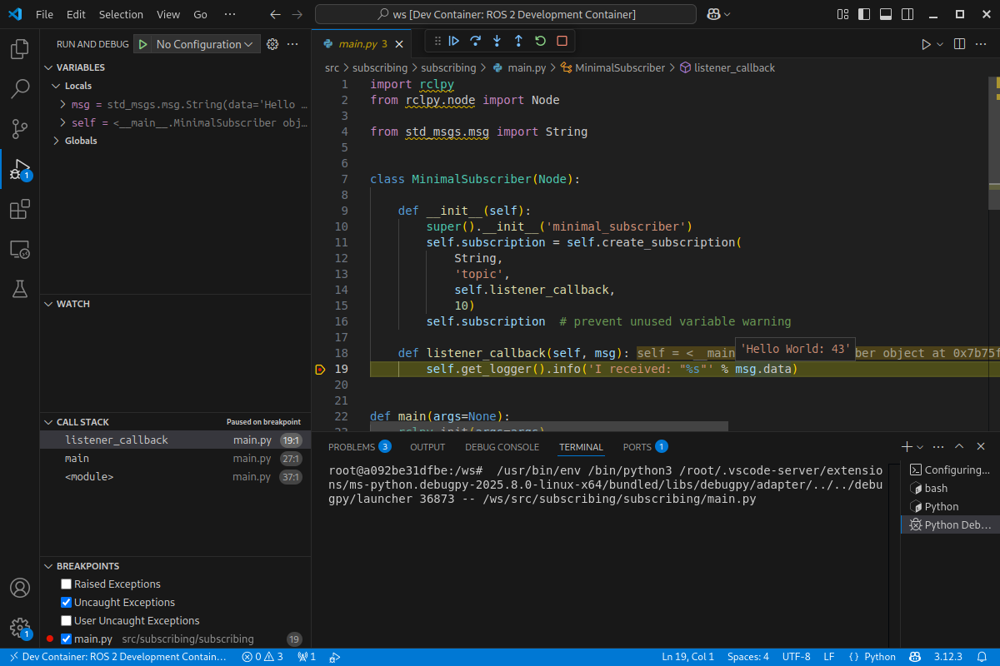

# Docker and ROS 2 for developers
This repository should teach you how to work with the [docker engine](https://docs.docker.com/engine/) and the latest stable ROS 2 LTE release [jazzy](https://docs.ros.org/en/jazzy/) in a modern development setup using [Visual Studio Code](https://code.visualstudio.com/) and [Dev Container](https://code.visualstudio.com/docs/devcontainers/create-dev-container). It also provides a source of example files and links to examples and projects that you can use to build more complex robot systems.

(_Not all of these are done, I just manged to finish the parts with the checkmark ✅_)

 - ✅ Part 1 introduces a basic ROS 2 and Docker setup with 2 Docker container connected over the internal Docker setup using **docker compose**.
 - ✅ Part 2 and 3 teach details about **Docker volumes** and handling file changes
 - ✅ Part 4 introduces **Dev Container** and using breakpoints in VS Code
 - ❌ [Part 5](https://github.com/brean/docker-ros/issues/4) includes **visual ros-tools** (rviz2) using Wayland
 - ❌ [Part 6](https://github.com/brean/docker-ros/issues/1) connects to real devices from inside docker, revisiting volumes and the special **device** option to use USB-Devices like Gamepads, lidar-scanner or the kobuki base.
 - ✅ Part 7 is a small detour to a more custom c-code for Raspberry Pi Pico2
 - ❌ Part 8 streams images from a WebCam in a more complex remote-control setup
 - ❌ Part 9 extends part 8 to not only stream camera images but also connection to other systems, how docker systems can be used in a "cloud robotics" **server setup**.
 - ❌ Part 10 discusses dependency management, we evaluate different systems that can be used to manage dependencies, from just using the apt **package manager** to more robotics specific systems like **vcstool** or **autoproj**.
 - ✅ Part 11 gives an example on how to deploy the docker image to your robot, how you cross-build using **dockerx** for your robots CPU and some best practices (From the [HelloRIC](https://github.com/helloric)-project).
 - ❌ Part 12 is about docker networking including possible pitfalls and issues with the **Docker network with ROS2**.
 - ❌ Part 13 is a bit specific for development at [DFKI-RIC](https://robotik.dfki-bremen.de/en/startpage), we take a look at the Open Source **Docker Image Development** environment. Even if you are not connected to DFKI, maybe it also makes sense for you to use or modify it to streamline your development process.

This tutorial is directed towards ROS 2 (mostly python) developers who want to accelerate their development process, ROS 2 basics are assumed.

## Installation
You need
1. [VS Code](https://code.visualstudio.com/download) (If you want to use [Codium](https://vscodium.com/) you can use [DevPodContainers](https://github.com/3timeslazy/vscodium-devpodcontainers), however it requires some more steps to setup and is still experimental so we focus on VS Code).
1. docker ([docker-ce](https://docs.docker.com/engine/install/) recommended)
   1. don't forget to do the [post-installation steps](https://docs.docker.com/engine/install/linux-postinstall/) (creating the `docker`-group and add yourself)
1. The [VS Code Dev Container extension](https://marketplace.visualstudio.com/items?itemName=ms-vscode-remote.remote-containers) (not needed for the first 3 parts)
1. (optional) [docker-nvidia-toolkit](https://docs.nvidia.com/datacenter/cloud-native/container-toolkit/latest/install-guide.html) if you have an nvidia-gpu and don't want software rendering for 3D tools like [rviz](https://docs.ros.org/en/jazzy/Tutorials/Intermediate/RViz/RViz-User-Guide/RViz-User-Guide.html), starting at step 5.
1. Beginner to intermediate ROS 2 and python knowledge, some docker basics. The [Tutorials](https://docs.ros.org/en/jazzy/Tutorials.html) on the ROS 2 website are a good start be aware of a steep learning curve if you are new to ROS!
1. Some disk space as docker container can take up some GB.

# Part 1: Docker and ROS (without devcontainer)
When you open this repositories folder in VS Code you'll get asked if you want to open in a container:


Just ignore it or press the small X in the top-right corner to close it.

If you already opened from inside the dev container or accidentially clicked on "Reopen in Container" click on "File" > "Open Recent" > and click on the folder without "[Dev Container]" in the name (it should be the top entry in the list).

Even if you want to use devContainer it is best practice to have a setup that also runs without it so people can run your container even if something does not work with their setup or if they want to use another IDE/Editor and not VS Code. It also makes it easier to deploy your docker container to the robot later on. I prefere `docker compose` to configure my docker container so I don't have to run long `docker`-commands.

First lets take a look at a simple ROS 2 setup with two custom ros packages in the `ros`-folder, it contains one package that publishes and a second package that has a subscriber to these messages. Its taken from the [tutorial for writing a basic publisher and subscriber in python.](https://docs.ros.org/en/jazzy/Tutorials/Beginner-Client-Libraries/Writing-A-Simple-Py-Publisher-And-Subscriber.html) So it should be easy to understand however both single subscriber and publisher scripts are accompanied by a some files to create individual packages and launch files for both as you might find in a more complex ROS 2 setup.

The application for this could be one ROS-package that you install on your PC while the other is running on your robot (often times accompanied by a third package that contains shared ROS-messages on both but as we are only sending basic strings we use the `std_msgs`-package that comes with our ROS 2 installation).
We will look at more realistic use cases in the later parts.

Because they are separated services they both can be seen as individual machines separated from your computer (your host machine) with their own file systems and networking. Docker compose automatically connects both to the same virtual network so we don't need to configure that.

Open a terminal, cd into the `part1`-folder of this repository and type `docker compose up publishing subscribing`. It will build and run the 2 docker images and start 2 docker container, one for publishing and one for subscribing, one outputs to the local docker network and the other is receiving these messages.
The source for both packages can be found in the `ros/`-folder

When you press <kbd>Ctrl</kbd>+<kbd>c</kbd> both container should exit, if you can't wait for them to stop, press <kbd>Ctrl</kbd>+<kbd>c</kbd> again or close the terminal window.

Afterwards you need to run `docker compose down` in the `part1`-folder to make sure both docker container and the network are removed.

This is nice as you now have a ROS 2 setup system-independent 
All files are build in your container, however you need to rebuild the docker container with `docker compose build` every time you change any file in your ros-packages and the files from the docker image differ from your local files. 

**Try for yourself**: 
1. Check out this repository and open it in VS Code, ignore/close the popup in the bottom right asking you to reopen in Dev Container
1. Build the container using `docker compose build` in the `part1`-folder
1. Change code in the `ros`-folder, for example change line 18 in the file `ros/publishing/publishing/main.py` from `msg.data = 'Hello World: %d' % self.i` to `msg.data = 'Sending: %d' % self.i`
1. restart the docker container without building by just running `docker compose up` in the `part1`-folder. You will still see the `Hello World`-messages.
1. re-run the `docker compose build`-command and then restart with `docker compose up`, now you should see the updated data getting published.
1. Run `docker compose down` inside the `part1`-folder for cleanup.

Also take a look at the [ROS 2 docker page on DockerHub](https://hub.docker.com/_/ros/) as it has some more informations and examples.

After you done the basic tutorials and are a bit advanced in ROS 2 I recommend you take a look at the articles at https://design.ros2.org/ as they explain the core functionality of ROS. At least keep in mind that this side exists in case you need a reference if you encounter some behavior of ROS that might seem strange or if you want to extend your system with security.

# Part 2: Docker Volumes
Using docker volumes you can increase your development speed: you don't have to re-run the `docker compose build` command all the time when you change code. Note that this only helps you for interpreted languages like python, for C/C++ applications it makes more sense to rerun the docker compose build-process manually (as the code has to compile anyway) and use a compile cache.

**Try for yourself**:
1. change into the `part2`-folder and run `docker compose build`
1. run `docker compose up` and keep it running
1. change the code, for example instead of "I heard: " you could print out something like "I received: " (in `ros/subscribing/subscribing/main.py`)
1. save the file. You'll notice that the output of your docker compose command still continues with "I heared:"
1. stop both docker container with <kbd>Ctrl</kbd>+<kbd>c</kbd> and directly recreate it with `docker compose up`.
1. Now you see the "I received:" - without the need of rebuilding the docker container!
1. Run `docker compose down` inside the `part2`-folder for cleanup.

Note that we build the packages with `colcon` as part of the `docker compose build`-process in the Dockerfile. This means that only the code at the time you build the image gets copied into your docker image. We overwrite the code later with the volumes when we start the container. This works because we build the package as `symlink-install`, so the files that are copied into the install-folder of your workspace (which can be found at `/ws/install` in your image) link to the files of your `/ws/src/subscribing` or `/ws/src/publishing` folders. If you remove the volume your old code will be used again, as it is stored in the image. This also means that when you have bigger changes, change your structure or add new packages you need to rebuild the image.

So volumes help with smaller changes while developing your code but you still need to rebuild the image when dependencies change or when you want to add additional nodes. You don't have to overwrite the full folder, you can also overwrite individual files as we see in the next part.

Using volumes already makes it nicer to work with docker and ROS writing python code, but we still have to restart the docker container manually, it would be nice if we could watch the file system for changes and restart our ros-node automatically, so lets do that next!

# Part 3: More on volumes (use case of automatically reloading using watchdog)
For automatically reloading file we use the Python 3 watchdog-package to check if the node changed and automatically restart it.

Because the docker container has its own folder structure and we now overwrite and add single files you might notice that it gets hard to keep track of this structure in your head. Remember that you can attach a bash to the container and check with "ls" to look at the file system inside the container.

**Try for yourself**
1. change into the `part3`-folder and run `docker compose build`. We need to install the `python3-watchdog` dependency so we can not use the one from part2 directly. As its good practice to install files that do not change easily like your base dependencies first we put it in the beginning of the Dockerfile-publishing, besides that the new Dockerfile-publishing looks the same as the one from the last part.
1. run `docker compose up` in the `part3`-folder. Take a look at the first lines of the log you should see a print like this telling you that an observer has been started: `[publishing-1] [INFO] [1748688244.627064228] [publishing]: Watchdog starting observer.`
1. change the `publishing/node.py` file inside the part3-folder. This will automatically restart the node. Because we watch the whole publishing-package you can change any file to restart, if you want to use it in your own projects you'll probably want to extend the logic in the `CodeChangeHandler::on_modified`-function to only reload when specific files are changed (e.g. only python files in the `publishing` and `launch`-subfolders).
1. In a new terminal run `docker compose run --rm publishing bash` to start a bash in a new container instance. This allows you to inspect files inside the container, use `ls` and `cd` to take a look around the `/ws/`-folder, which is your whole workspace. Because we did a `--symlink-install` the files from the `build`-folder link to your local `/ws/src/publishing/`-files where we have overwritten with our local volume mounts.

```bash
root@8e117851d90b:/ws/# ls -al /ws/build/publishing/launch/publishing.launch.py
lrwxrwxrwx 1 root root 42 May 31 10:20 /ws/build/publishing/launch/publishing.launch.py -> /ws/src/publishing/launch/publishing.launch.py
```
5. Press <kbd>Ctrl</kbd>+<kbd>c</kbd> to exit the docker container.
1. As always run `docker compose down` for cleanup.

Note that each container runs as its own instance, so the container running bash you just started and stopped is independent from your other subscription and publishing container and their file systems. They all share a few files from the volumes but all other files only exist while the container is running! So if you change any other file, add new files or delete files that are not linked to your file system via volume and you exit the container your changes are gone. If you start a new container with either `docker compose run`, `docker run` or `docker compose up` this new container gets created from the image as it was created from the Dockerfile, it has no memory of the container that came before.

When you look at the `compose.yml`-file, you'll see that we overwrite the launch file with a local file of the same name, the only change is that this launch file automatically restarts the container, we also overwrite main.py with our `watchdog_dev.py`-file and finally we add a new node.py-file that includes a copy of our old subscriber-node.

So we can use this to link any file or folder of the host system to any file or folder inside the docker container. Always make sure that the file names are correct, if you mistype the file name in your compose.yml on your host system for example, docker will create a folder for it and try to mount that folder into the docker image.

In the next part we will take a look at Dev Container so we can run commands directly from inside the VS Code terminal inside the docker container to execute ros2 commands quickly and increase our productivity even more.


# Part 4: Basic ROS with docker in a Dev Container
To have the full [VS Code](https://code.visualstudio.com/docs/devcontainers/create-dev-container) integration to use development tools like a local python debugger we have a third docker image where we put both packages in one image for the dev-container.

There is already a Dev Container setup for this repository, you find it in form of the file `.devcontaienr/devcontainer.json`. This is the minimalistic setup that just points to the compose.yml file in the root folder of the repository to use the pubsubdev-server defined in the file.
For development we also install some ms-python extensions for VS Code so we can use debugpy to set a breakpoint.

The docker compose file itself includes volumes to the `publishing` and `subscribing` folders which both get installed inside the docker container. Because we want to have a bit more control we do not use the automatic reloading feature from part 3 so we have to run the ros2 commands to start subscribing and publishing manually.

Note that we also overwrite the command to run `sleep` infinitely. This is needed as it keeps the container alive so VS Code can attach to it. Attaching to a container is different from running a new container, we only use the container to synchronize files, it does not spawn a new container.

**Try for yourself**
1. Klick on the blue "><"-Icon in the bottom-left of the VS Code window.
1. Select "Reopen in DevContainer"
1. Open the file `src/publishing/publishing/main.py` and click on the play-button in the top-right. This starts the publisher in your terminal. Just let it running. Note that you started the node as simple ros-application without any ros setup.
1. Open the file `src/subscribing/subscribing/main.py` and click left of line 19 to create a breakpoint when the listener-callback gets called.
1. Instead of pressing the play button press the small arrow next to it and select `Python Debugger: Debug python file`. Again this runs the main-script as python file not thorugh ros but because we are inside the dev container we are using the python environment of our ros system so rclpy can be found and both scripts should be able to talk to each other so you should get the thrown into the debugger immediately when a message gets received:



6. To see that debugging works you can check the value of `msg.data` by hovering over it with your mouse.
1. You can now stop the debugger and exit the container again and switch back to the main repository inside your file system again by clicking on "File" > "Open Recent" > and click on the repository folder without "[Dev Container]" in the name (it should be the top entry in the list).

Instead of running the `src/publishing/publishing/main.py` file from visual studio you could have also used the terminal:
1. Go back inside the container (press on the blue "><"-Icon in the bottom-left of the VS Code window) and select "Reopen in Container" or select "File" > "Open Recent" and click on the folder with "[Dev Container]" in the name.
1. Right-click in the file list and click on "Open in Integrated Terminal"
1. In the terminal you can now run ROS-commands inside the attached ros container, so you can simply run `ros2 launch publishing publishing.launch.py` or `ros2 run publishing publishing` to start the publisher.

Because it is a symlink-install you can quickly change the main.py file before running the ros2-command and the changes will be applied directly.

This is the minimum basic setup for a dev-container, we will at another, still simple but more realistic setup in the next part.

For more details read about the [VS Code Python debugging documentation](https://code.visualstudio.com/docs/python/debugging).


# Part 5: GUI-Tools and Camera streams (RVIZ, RQT and Gazebo)
TODO: Why Wayland - X11 isn't fully dead yet?!

TODO: rviz and ros2 bag

TODO: Gazebo/rqt


# Part 6: Docker and real hardware
TODO: the special `device:` / `--device` option in docker / compose

TODO: pitfalls working with hardware, when to use RW and privileged.

TODO: Docker + USB: Always get same address (udev-rules)


# Part 7: Using docker for microros development (FreeRTOS on Raspberry Pi Pico)
If you want to develop your own realtime microros-firmware the VSCode devcontainer could also be helpful, take a look at the [MicroROS Firmware for Huginn](https://github.com/brean/microros_firmware_huginn).
The devContainer in that project installs all required dependencies for microcontroller development without the need to install it locally, paths for the required SDKs are set so VS-Code can show you helpful error messages and code-autocompletion.

It clones the [MicroROS Raspberrypi Pico SDK](https://github.com/micro-ROS/micro_ros_raspberrypi_pico_sdk.git) and overwrites its CMakeLists.txt in the Dockerfile. Without devContainer you would fork the `micro_ros_raspberrypi_pico_sdk`-repository and change the `CMakeLists.txt` and/or `pico_micro_ros_example.c`.

You just change the code and build it inside the devcontainer and then copy the `.uf2`-file to your pico. Take a look at the `compose.yml` file to see how volumes are used to support the deveopment.

Note that MicroROS only provides a limited number of services (normally just one in the generic configuration!)

# Part 8: Image and Video streaming
TODO: Easy: stream images directly, rqt-image-view

TODO: WebRTC and Web-Output


# Part 9: Include a webserver to control a robot
TODO: include https://github.com/brean/svelte-robot-control and gazebo


# Part 10: Dependency Management
TODO: discuss where to install what dependencies and show options like autoproj, vcs, ...

# Part 11: Deploy to a robot
On your robot you want to know exactly what software is running. Its often the case that, after testing and deploying to your robot you make changes specifically for your system on it. These changes sometimes do not find their way back into documentation or your code base. So instead lets look at different ways to deploy Docker images to the robot.

### versioning
In your compose.yml you can define an image name, we use this to give our image a tag including a version number and its version for example "jazzy_arm64_001" for a jazzy-based on arm64 with version number 0.0.1.

### cross-building for another architecture
To cross-build for another architecture (if you have an Intel/AMD or M1-mac CPU and your robot has an ARM64, for example a Raspberry Pi) you need to cross-build for this other architecture. This is fairly easy, just create a new builder for the arm64 architecture using buildx, if you define the services inside your compose.yml file they will just build. A script that creates a new builder if needed and runs docker could look like this:
```bash
#!/bin/bash
# Set the name of the builder
BUILDER_NAME="my_builder"

# Check if the builder already exists
if docker buildx inspect "$BUILDER_NAME" > /dev/null 2>&1; then
    echo "Builder '$BUILDER_NAME' already exists."
else
    echo "Builder '$BUILDER_NAME' does not exist. Creating a new one..."
    
    # Create a new builder with the docker-container driver
    docker buildx create --name "$BUILDER_NAME" --use --driver docker-container
    
    # Inspect the newly created builder
    docker buildx inspect --bootstrap "$BUILDER_NAME"
    
    echo "Builder '$BUILDER_NAME' created and set as the active builder."
fi
docker compose build
```

After building you can optionally push directly to your configured docker registry using `docker compose push`. Don't forget to login to your registry by calling `docker login YOUR_REGISTRY` first. `dockerhub` is configured as default, so a simple `docker login` is enough if you want to publish there.

### Without deploying to dockerhub
If you don't want to publish your docker image to dockerhub or your robot does not have access to dockerhub you can simply save the build image and load it on the robot like this:
```bash
# on your PC
docker save -o my_image.tar my_image:jazzy_arm64_001
# copy this to the robot, change X.X.X.X to the actual IP of the robot, do NOT remove the colon (:) at the end
scp my_image.tar robot@X.X.X.X:

# now SSH  on the robot and load the image like this:
docker load -i my_image.tar
```
Because the image can be a few GB big its recommended to connect PC and robot via cable.

### Excample project
As an example for a repository that can be used in production to build a docker container you can simply deploy on a raspberry pi take a look at the [Docker Environment for the Kobuki base](https://github.com/helloric/docker-env-kobuki)


# Part 12: ROS 2 and network
The biggest change from ROS 1 to ROS 2 is that instead of a basic Server-Client architecture ROS 2 uses a peer-to-peer communication model facilitated by [DDS (Data Distribution Service)](https://design.ros2.org/articles/ros_on_dds.html). Combined with the virtual network provided by Docker, the configuration of your network manager, the real network devices of your machine and the configuration of services in the network itself (like DHCP) this becomes a very complex setup quickly that can be hard to configure and debug.

TODO: Flow-Chart for issues

TODO: Docker network devices on linux and their issues (network manager that might interfer)

TODO: When to use network-mode: host

TODO: special IP addresses in the Docker network (The special 172.17.0.1 ip) (*Note on this magic IP: Some open WiFis use the same IP range, Deutsche Bahn is using the 172.X.X.X-network for their "WIFIonICE" Network for example, so if you don't get WiFi on the train configure your docker network to use another IP address pool like described [here (in German)](https://forum.ubuntuusers.de/topic/probleme-mit-dem-wifionice/#post-8964926).*)

TODO: Debugging issues with networking (own document?)

TODO: Discuss the issue if ROS 2 topic can be seen but no data

TODO: How and when does the ROS 2 middleware decide when to use memory and when does it 

TODO: the Future use zenoh everywhere!

# Part 13: The DFKI Docker Image Development
TODO: Link to basics on https://github.com/dfki-ric/docker_image_development

TODO: create repo using docker_image_development and integrate it in devContainer.
